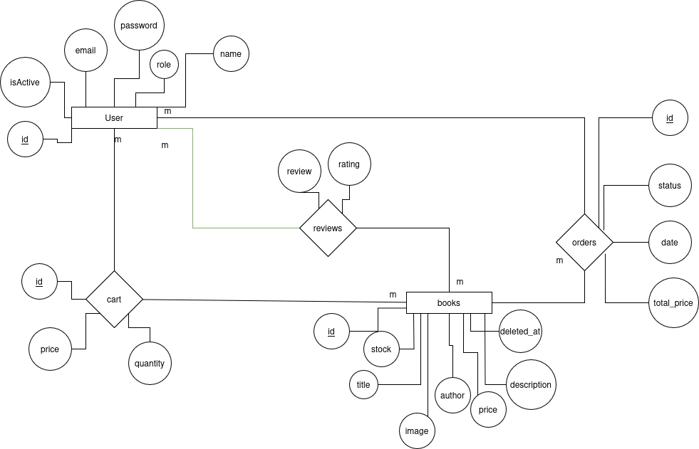

# **BookStore**

## **Live URL**
- 📚 **Demo Website:** [Simple Website](http://iti-bookstore.s3-website-us-east-1.amazonaws.com/)
- 📑 **API Testing:** Swagger UI (Live)
- 📧 **Email Testing:** MailHog (Live)

---

## **Project Overview**
The **BookStore** project is a **RESTful API** built with **Node.js**, **Express**, and **MongoDB** using **Mongoose**. It provides features like managing books, carts, orders, and reviews, along with authentication, authorization, and advanced functionalities, including:

- **Real-Time Communication:** **Socket.IO**
- **Caching:** **Redis** for performance optimization
- **Email Testing:** **MailHog**
- **API Documentation & Testing:** **Swagger**
- **Validation:** **Joi**
- **Templating:** **Pug** for mail-rendered views

### 💡 **Live Testing Options**
- **API Testing:** Users can directly test API endpoints through the **Swagger UI**.
- **Email Testing:** **MailHog** allows safe testing of email functionalities.
- **Website Demo:** The demo website provides a simple frontend to interact with the backend.

---

### **Technologies Used**
- **Backend:** Node.js, Express
- **Database:** MongoDB with Mongoose
- **Caching:** Redis
- **Real-Time Communication:** Socket.IO
- **Email Testing:** MailHog
- **Authentication:** JWT with password hashing using `bcrypt.js`
- **Validation:** Joi
- **File Handling:** `multer` for file uploads
- **Templating Engine:** Pug
- **API Documentation:** Swagger

---

### **Key Features**
- **Authentication & Authorization:** Secure JWT-based routes
- **Book Management:** CRUD operations with pagination and filtering
- **Order Transactions:** Atomic operations like stock reduction with order creation
- **File Uploads:** Book cover images using `multer`
- **Real-Time Updates:** Using **Socket.IO**
- **Caching:** Performance enhancement with **Redis**
- **Email Notifications:** Local testing via **MailHog**
- **Validation:** Input validation using **Joi**
- **API Documentation:** Automatically generated and testable through **Swagger UI**
- **Server-Rendered Views:** Using **Pug** for templating
- **Error Handling:** Centralized error management with `winston` logging

---

## **Installation**
1. **Clone the repository:**
```bash
git clone https://github.com/danielfarag/bookstore.git
cd bookstore
```

2. **Install dependencies:**
```bash
npm install
```

3. **Configure environment variables:**
```bash
cp .env.example .env
```
Fill in the required values in the `.env` file.

4. **Start the server:**
```bash
npm run dev
```

---

